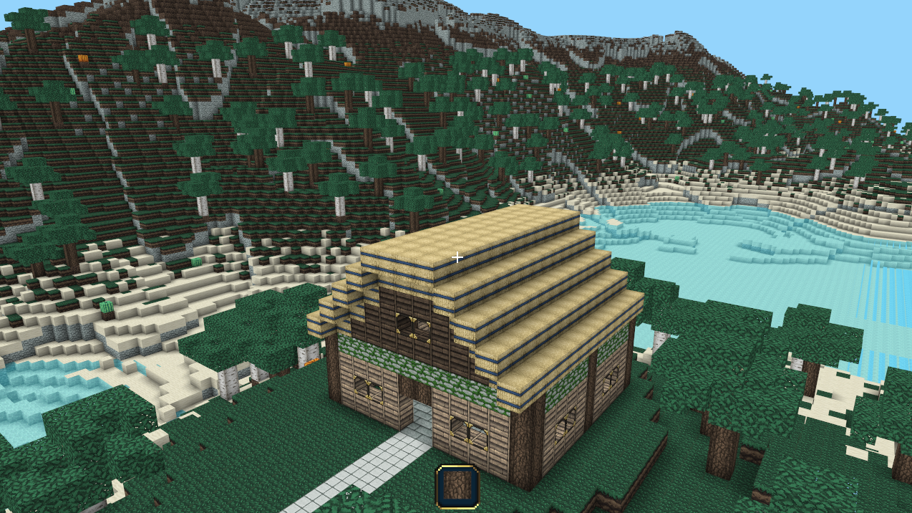

# Python-Voxel-Engine
A Voxel Engine written in Python and OpenGL

A high performance Minecraft-Style Voxel Engine written in Python with PyGame and ModernGL for graphics rendering. I created this project to experiment with and learn about 3D graphics and OpenGL.

  

## Features

### Random World Generation

Explore a randomly generated world with hills, valleys, lakes and caves!

### Creative Building and Destruction

Mold the world to your liking. Place and destroy voxels and build with 44 different types of blocks.

## Dependencies

This project uses the following libraries:

- [Pygame](https://www.pygame.org/news)
- [ModernGL](https://moderngl.readthedocs.io/en/latest/)

© Nathan Foote | 2023
